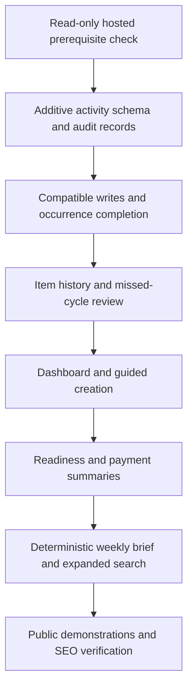

# Household platform refactor

Approved direction: October 8, 2026. Implement incrementally, preserving the existing light lavender design, private account ownership, record identifiers, alert capacity and public URLs.

## Architecture assessment

Next.js App Router and React render pages and client interactions. Authenticated server actions validate inputs and call Supabase PostgreSQL RPCs. Google identity is managed by Supabase Auth. Tables permit owner-scoped SELECT through RLS; writes go through restricted security-definer functions and account locks. Supabase Storage holds private, validated documents. Resend and web push use occurrence-specific queues with leases and eligibility checks. PayMongo checkout grants item alert capacity after verified payment. SMS remains unavailable.

The existing model already separates items, important dates, occurrences, offsets and delivery queues. Purchases and warranties are compatibility views. One item may contain ten dates; its enabled dates share one alert slot. Records do not require paid alerts. Existing calendar recurrence supports monthly, quarterly, six-monthly and annual anchors. Elapsed recurring dates become unconfirmed, never automatically paid.

Reuse the category picker, provider selections, search and cursor pagination, recurrence arithmetic, private uploads, notification queues, entitlement reconciliation, sample account and SEO pages. Do not introduce a second event scheduler, payment system or household ownership model.

## Target model and dependencies

Release 1 adds item activities, document associations, private correction/review records and explicit recurrence policy. Occurrence IDs identify completion targets. A stable activity ID identifies retries. Database transactions combine activity creation, occurrence completion, future scheduling and alert reconciliation. Existing completion callers remain supported through a trigger that records known completion facts. Historical costs and actors are never inferred.

Activities record their item, optional occurrence, scheduled date snapshot, type, title, completion date, optional actual cost, PHP currency, notes, actor when known, source and revision. Corrections retain audit snapshots and do not change future schedules. Voiding a linked activity returns its occurrence to unconfirmed while preserving the current future schedule. Reviewing an unconfirmed occurrence can explicitly mark it skipped, with a reason. Private audit data is removed with the owning account or item according to existing deletion behavior.

Fixed schedules retain the original anchor. Service completion can explicitly choose a schedule measured from completion; such schedules wait for completion instead of silently advancing in cron. Warranties cannot repeat. Other recurrence frequencies, sharing and natural-language search remain deferred.

Later schema work should add category-aware readiness preferences, amount certainty and occurrence-level expected amounts. Legacy saved amounts are unverified, not automatically confirmed. Account-wide summaries must query all relevant records rather than the selected dashboard preview. Never sum different currencies.

## Releases and implementation checklist

### Release 1: history and lifecycle

- [x] Add activity tables, owner constraints, audit records and grants.
- [x] Preserve known legacy completions and capture old-client writes.
- [x] Complete a selected open or unconfirmed occurrence with safe replay handling.
- [x] Support manual activities, notes, actual costs and existing authorised documents.
- [x] Correct and void activities without rewriting future schedules.
- [x] Resolve missed cycles explicitly without manufacturing completion.
- [x] Keep unresolved past occurrences available after automatic recurrence advances.
- [x] Verify cron/completion races, legacy compatibility and pagination locally.
- [x] Verify success, errors, cancellation and small-screen UI in local Chrome and WebKit.

Hosted migrations are confirmed applied as of October 9, 2026. Hosted integration and physical-device checks remain deployment prerequisites. See `docs/household-history-setup.md` for the execution order and evidence limits.

### Release 2: core experience

- [x] Put attention before planning and records; keep metrics navigable.
- [x] Integrate list/timeline planning without duplicate default sections.
- [x] Provide account-wide attention including unresolved past cycles.
- [x] Shorten contextual forms and allow gradual record completion.
- [x] Preserve categories, providers, existing vehicles and optional alerts.

Local private-account and demo flows are verified in Chrome desktop/mobile and WebKit mobile. Hosted migrations are confirmed applied as of October 9, 2026. Provider checks remain prerequisites in `docs/household-core-setup.md`.

### Release 3: insights

- [x] Deliver contextual readiness with unknown/not-applicable/dismissed states.
- [x] Show confirmed, estimated and unspecified upcoming payment amounts honestly.
- [x] Build concise weekly templates entirely from saved data.
- [x] Extend server-side search to notes, history, dates and authorised file names.

Local Release 3 checks passed in Chrome desktop/mobile and WebKit mobile, including production demo checks over local HTTPS. All 34 hosted migration markers are confirmed PRESENT by the owner on October 9, 2026. Do not rerun them. See `docs/household-insights-setup.md` for the read-only prerequisite check, exact migration order and evidence limits.

### Release 4: public experience

- [x] Keep the headline and use Explore a sample account.
- [x] Demonstrate only finished features with clearly fictional data.
- [x] Preserve public routes, metadata, canonicals, indexing, structured data and sitemap.
- [x] Validate rendered SEO and run Lighthouse on affected public pages.

All four implementation releases are complete locally. Release 4 passed production Chrome at 1280, 390 and 320 px and WebKit at 390 px, with zero page errors. Homepage Lighthouse scored 97 performance, 100 accessibility, 100 best practices and 100 SEO. The sample dashboard scored 90/100/100/66, with the SEO deduction due to its intentional noindex directive. See `docs/household-public-release.md` for the new browser script, exact commands and evidence limits. Deployment and hosted acceptance checks remain.

## Acceptance and verification

Duplicate or concurrent completion produces one activity and advances once. Lost-response replay returns the original result. A reused request ID with different data fails. Late completion affects the selected historical occurrence. Activity edits retain scheduled-date snapshots and do not reschedule anything. Void and skip require reasons. Cross-account RPC, file association, direct mutation and anonymous-access attempts fail. Account deletion and file deletion do not leave exposed associations.

Verify month-end anchors, February 29, end dates, account-local day boundaries, past and future dates, archived items, ended schedules, old clients, records without dates, exhausted alert capacity and more than one page of history. Cover races with the recurring worker and preserve accepted notification identity. Run lint, typecheck, unit tests, isolated PostgreSQL integration tests, build and HTTP smoke tests. Browser tests must include cancellation, validation errors, retry and mobile layouts. Physical devices and real Auth/Storage/delivery/payment checks are separate evidence, not implied by local results.

## Rollout and rollback

Run the release's read-only prerequisite SQL in hosted Supabase. Compare missing markers to actual migration history and apply only confirmed missing migrations in sequence. Do not rerun confirmed migrations. Back up both database and objects and test recovery. Apply schema before matching code. Pause notification/maintenance workers during lifecycle migration and restore them after compatible code is deployed and verified.

Rollback retains additive data and compatible completion triggers. Do not revert the database by dropping activity tables or replaying old migrations. A UI rollback can hide new controls while old completion calls continue to record history. Returning from completion-based maintenance policy to old code requires an explicit policy review because old UI does not expose that choice.

## Risks and deferred decisions

Hosted schema and provider state require verification before deployment. SECURITY DEFINER functions must check account and item ownership even though tables have RLS. Account locks serialize updates and must retain the existing lock order. History grows over time, so queries use indexed cursor pagination. Readiness criteria must not penalise optional sensitive files. Payment forecasts require a shared horizon definition and duplicate-free recurrence projections. Sharing needs a separate membership/access design; no existing document becomes shared by default.

Public copy and branding stay Keeply, with en-PH and en_PH metadata. Alerts support household organisation. Do not add bank integrations, automatic payments, AI APIs, email briefs, calendar exports, new pricing or unsupported channels as part of this refactor.
